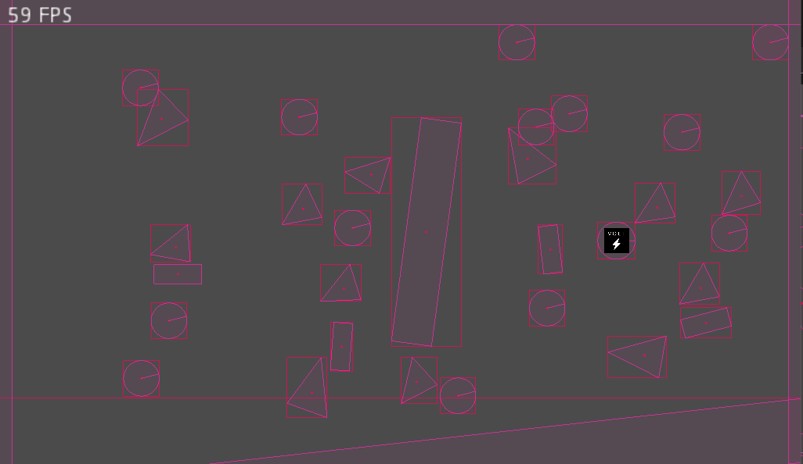

# GodotFixedVoltatilePhysics

 

Fixed-point 2D physics in Godot C# using a modified version of [cathei's Fixed point fork of VolatilePhysics](https://github.com/cathei/VolatilePhysics-FixedMath).

## Features
- Dynamic rigid bodies
- Kinematic bodies
- Static bodies
- Area bodies
- Shape editors
- Debug drawing
- Collision layers and masks

## Examples

